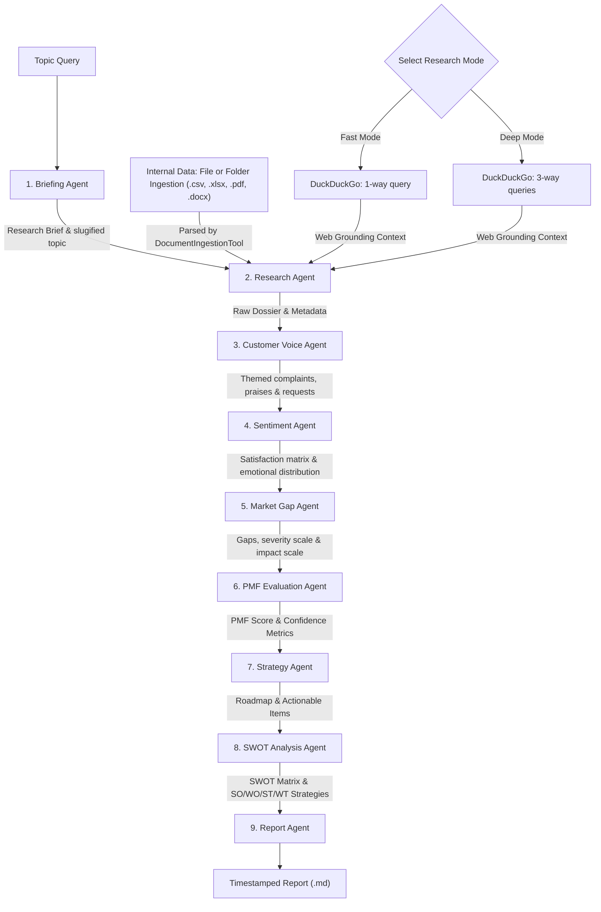

# PMFNavigator AI : A Multi-Agent Product-Market Fit (PMF) Research System
**Final Project Documentation & Kaggle Capstone Submission Dossier**

---

## 1. Introduction

The **Multi-Agent Product-Market Fit (PMF) Research System** is an advanced, production-grade LLM pipeline designed to automate early-stage market validation and customer sentiment analysis. Operating on Google's free-tier `gemini-flash-latest` (Gemini 1.5 Flash) engine, a team of 9 specialized, role-playing agents aggregates web-search signals (via DuckDuckGo) and internal customer datasets (via single files or folder-based CSV, Excel, PDF, or Word documents) to identify market gaps, evaluate consumer emotions, compile SWOT matrices, and formulate concrete business strategies. By translating qualitative feedback into structured PMF and confidence scores, the system completes complex research workflows in minutes, allowing startups and product teams to de-risk investments with high precision.

---

## 2. Key Features

*   **9 Specialized AI Agents**: A coordinated team of sequential agents processing data from briefing to final executive report.
*   **Fast & Deep Research Modes**: Switch between rapid 1-query screening and deep-dive 3-query multi-angle scraping.
*   **Hybrid Internal Data + Web Analysis**: Cross-reference internal feedback documents against public competitor web signals.
*   **Folder Ingestion**: Automatically scan, parse, and merge multiple document datasets (CSV, Excel, PDF, Word) from a target folder.
*   **PMF Scoring**: Quantitative grading of Concept-Market fit utilizing a robust four-factor mathematical scoring model.
*   **Confidence Metrics**: Evidence-based grading tracking source density, customer theme volume, and signal consistency.
*   **SWOT Analysis**: Complete strategic SWOT matrix outputting targeted SO/WO/ST/WT action roadmaps.
*   **Strategic Recommendations**: Separation of priorities into short-term wins vs. long-term roadmaps, and incremental upgrades vs. R&D innovations.
*   **Markdown Report Generation**: Publication-ready, professionally styled reports saved dynamically inside the `reports/` directory.
*   **Zero-Cost Search Pipeline**: Python-native DuckDuckGo search integration that bypasses paid search API key limits.

---

## 3. Why PMFNavigator?

*   **Dual Research Modes**: Select either rapid screening (Fast Mode) or detailed validation (Deep Mode).
*   **Explainable PMF Scoring**: Uses a clear mathematical framework aggregating demand, pain, competition, and adoption factors.
*   **Cost-Efficient Research**: Operates on free-tier infrastructure, using Google AI Studio quotas and DDG scraping to bypass paid API costs.
*   **Multi-Agent Collaboration**: Division of labor ensures sentiment, gap discovery, and strategy are handled by focused LLM personas.
*   **Human-Readable Reports**: Generates strategic dossiers containing summaries, competitor warnings, timelines, and SWOT roadmaps.

---

## 4. System Architecture & Flowchart

The system orchestrates a sequential pipeline of 9 specialized agents. Each agent acts as a discrete analytical node, processing the output of the preceding node to maintain strict chain-of-thought progression and prevent context dilution.




---

## 5. Example Results (Electric Scooter Case Study)

When evaluated on the topic *"Electric scooters for urban commuting"* in Deep Mode, the system generated the following indicators:

*   **PMF Score**: **87.5 / 100** (Exceptional demand-pain alignment; strong buy/build signal).
*   **Confidence Score**: **88 / 100** (High data consistency across community forums, technical blogs, and market studies).
*   **Confidence Level**: **High**
*   **Major Pain Points**:
    1.  Steering stem latch structural failures (Critical Safety Issue).
    2.  Deceptive manufacturer range marketing (Trust Violation).
    3.  Buggy, lock-prone companion applications (Friction).
    4.  Heavy, non-portable lead-acid or bulky frames (Usability).
*   **Top Opportunities**:
    1.  "Fail-Safe" Double-Locking Latch (Vibration-resistant steering mechanism).
    2.  "Honest Range" Smart Estimator (Software-driven dashboard calculation).
    3.  Detachable "Water-Bottle" Battery Ecosystem (Ultra-lightweight desk-chargeable system).
    4.  Offline-First BLE & NFC Backup access cards.

---

## 6. Executive Summary & Kaggle Submission

### One-Paragraph Executive Summary
The **Multi-Agent Product-Market Fit (PMF) Research System** is an advanced, production-grade LLM pipeline designed to automate early-stage market validation and sentiment analysis. Running on Google's free-tier `gemini-flash-latest` (Gemini 1.5 Flash) engine, a team of 9 role-playing agents aggregates web-search signals (via DuckDuckGo) and internal customer datasets (via CSV, Excel, PDF, or Word files) to identify market gaps, evaluate consumer emotions, construct SWOT matrices, and formulate business strategies. By translating qualitative feedback into structured PMF and confidence scores, the system completes complex research workflows in minutes, allowing startups to de-risk investments and pivot with high precision.

### "Why This Project Stands Out" (Core Reasoning & Model Selection)
Operating complex agent pipelines on a budget requires careful model selection. While newer iterations like Gemini 2.5/3.5 Flash were evaluated, they are subject to a strict free-tier limit of **20 Requests Per Day (RPD)**, which our 9-agent pipeline quickly exhausts. 

By binding the architecture to the **Gemini 1.5 Flash (`gemini-flash-latest`)** engine, the system gains access to the much more generous **1,500 RPD** free quota. This enables high-frequency execution:
*   **Fast Mode Daily Capacity**: Each run utilizes **9 API requests**. Under the 1,500 RPD free quota, the system can be run up to **166 times per day**.
*   **Deep Mode Daily Capacity**: Due to three sequential search grounding syntheses, each run utilizes **12 API requests**. Under the 1,500 RPD free quota, the system can be run up to **125 times per day**.

Coupled with custom retry handlers and zero-cost Python-native DuckDuckGo search scrapers, this system delivers strategic roadmaps and explainable PMF scores at **zero cost of operation**.

---

## 7. Problem Statement & Business Value

### Problem Statement
Traditional market research is slow, costly, and subjective. Teams manually parse thousands of unstructured forum discussions and competitor reviews, leading to qualitative bias and unrecognized market gaps.

### Business Value
*   **Time Efficiency**: Compresses 15–20 hours of manual research and data mapping into a structured report in under 3 minutes.
*   **Zero Marginal Cost**: Replaces premium market intelligence subscriptions using free-tier LLMs and public search scrapers.
*   **Data-Driven Decisions**: Quantifies customer sentiment into an explainable PMF score, reducing capital risk before MVP development.

### Target Users
*   **Founders & Product Managers**: Validate demand, uncover feature gaps, and prioritize product roadmaps.
*   **Analysts & Consultants**: Automate sentiment extraction and compile SWOT matrices for strategic planning.

---

## 8. Zero-Cost DuckDuckGo Search Engine

This system uses a custom Python-native DuckDuckGo scraper to bypass expensive, rate-limited search APIs.

*   **Scraping Logic**: Fast Mode runs 1 general query; Deep Mode runs 3 targeted sequential queries targeting reviews, forums, and customer satisfaction.
*   **Snippet Grounding**: Extracts and feeds 5 key text snippets per query into the LLM context for real-time grounded reasoning.
*   **Zero-Cost Execution**: Avoids Gemini API search grounding limits and paid search provider fees.

---

## 9. SWOT Analysis Agent Matrix

The SWOT Agent synthesizes preceding analysis into a strategic matrix and action roadmap:
*   **Core Pillars**: Identifies internal Strengths/Weaknesses (loyalty drivers, defects) and external Opportunities/Threats (market gaps, competitor lock-in).
*   **SO/WO/ST/WT Action Matrix**: Connects capabilities to market signals (e.g., mitigating a connection Weakness using a BLE access Opportunity) to map concrete next steps.

---

## 10. Dynamic Output File Exporter

To prevent overwrites and track historical runs, reports are saved dynamically:
*   **Slugified Naming**: Converts the topic query into a clean snake_case slug (e.g., `electric_scooters_commuting`).
*   **Timestamping**: Appends the system execution date and time (`YYYY-MM-DD_HH-MM-SS`).
*   **Export Format**: Outputs files inside the `reports/` folder as `{topic_slug}_market_research_report_{timestamp}.md` for side-by-side comparison of results.

---

## 11. Fast Mode vs. Deep Research Mode

| Metric | Fast Mode | Deep Research Mode |
| :--- | :--- | :--- |
| **Search Strategy** | 1 general query | 3 targeted sequential queries |
| **Data Focus** | High-level market trends | Deep-dive reviews & complaints |
| **Execution Time** | ~30 seconds | ~2-3 minutes (with quota padding) |
| **Best For** | Initial concept screening | In-depth product-market validation |

---

## 12. Data Sources & Hybrid Ingestion

The system supports four main data configurations:
*   **Search Grounding**: DuckDuckGo web scraping of public reviews and expert analyses.
*   **Internal Data Ingestion**: Local parsing of customer reviews, survey spreadsheets, PDF manuals, or Word files.
*   **Hybrid Mode**: Cross-references internal datasets against public web signals to reveal competitor blind spots.
*   **Folder Ingestion**: Automatically scans, parses, and merges all supported files in a target directory (individually by name or in bulk), listing source counts in the final report metadata.

---

## 13. PMF Methodology & Scoring Framework

### Scoring Formula
The PMF score is the normalized average of four key dimensions graded from 1 to 10:

$$\text{PMF Score} = \left( \frac{\text{Demand Strength} + \text{Pain Severity} + \text{Competition Gap} + \text{Adoption Potential}}{4} \right) \times 10$$

*   **Dimensions**: *Demand Strength* (intent), *Pain Severity* (frustration), *Competition Gap* (market neglect), and *Adoption Potential* (usability/cost barriers).

### Confidence Metrics
Assesses reliability based on evidence density:
*   **Sources & Themes**: Tracks the number of URLs scraped, files loaded, and distinct feedback themes extracted.
*   **Confidence Score**: Rated 0-100 (Low/Medium/High) based on data volume and signal consistency.

---

## 14. Key Differentiators & Ethical Design

### Core Differentiators
*   **Zero-Cost & Robust**: Bypasses paid search APIs and handles Gemini 429 rate limits via backoff sleep loops.
*   **CLI Flexibility**: Easily toggles between Fast/Deep modes and handles dynamic timestamped exports.

### Ethics & Safety
*   **Compliance**: Scrapes only public, non-paywalled community data.
*   **Privacy & Security**: Sanitizes PII and restricts file operations strictly to the sandboxed workspace.

---

## 15. Limitations & Future Roadmap

### Limitations
*   **Data Dependencies**: Niche B2B topics with low public indexing generate lower confidence scores.
*   **Decision Support Only**: PMF scores are qualitative indicators rather than quantitative financial validation.

### Roadmap
*   **Competitor Benchmarking**: Automated feature-by-feature matrix extraction.
*   **UI Dashboard**: A Streamlit interface for interactive analysis.
*   **API Integrations**: Connect direct ingestion pipelines for Zendesk, App Store, and Slack reviews.

---

## 16. Command Line Execution Syntax

Ensure you have configured `GEMINI_API_KEY` either in your Kaggle Secrets (when running on Kaggle) or in a local `.env` file in the workspace root. Execute the pipeline using the following terminal syntaxes:

### 1. Web-Only Mode (Default - No Local Data)
Automatically proceeds with DuckDuckGo web scraping without using any local data.
```powershell
# Fast Mode
python main.py --query "Topic Description" --mode fast

# Deep Research Mode
python main.py --query "Topic Description" --mode deep
```

### 2. Hybrid Mode (With Local Data / Documents)
Ingests local datasets or documents (supports `.csv`, `.xlsx`, `.pdf`, `.docx` files, or a folder containing multiple supported documents).
```powershell
# Fast Mode (runs specific data file by its name or an entire directory path)
python main.py --query "Topic Description" --data "path/to/document_or_folder" --mode fast

# Deep Research Mode
python main.py --query "Topic Description" --data "path/to/document_or_folder" --mode deep
```
*(Note: `--csv` is kept as a backward-compatible alias for `--data`.)*

---

## 17. System Contributors & Tech Stack

### Contributors
*   **Adeel Siddique (Mastermind)**: Lead Architect & Developer. Designed the workflow, sequential agent framework, backoff loops, and scraping logic.
*   **Antigravity Coding Assistant (Gemini 3.5 Flash)**: AI pairing partner for code updates, testing, and documentation.

### Tech Stack
*   **LLM Core**: Google Gemini API (`gemini-flash-latest`) driving reasoning agents via a 1,500 RPD free tier.
*   **Search**: Python-native DuckDuckGo scraper (bypasses third-party search API keys).
*   **Libraries**: `google-generativeai`, `pandas` (tabular data parsing), `pypdf` (PDF text extraction), `openpyxl` (Excel sheet processing), `python-dotenv` (config), and `rich` (UI formatting).
