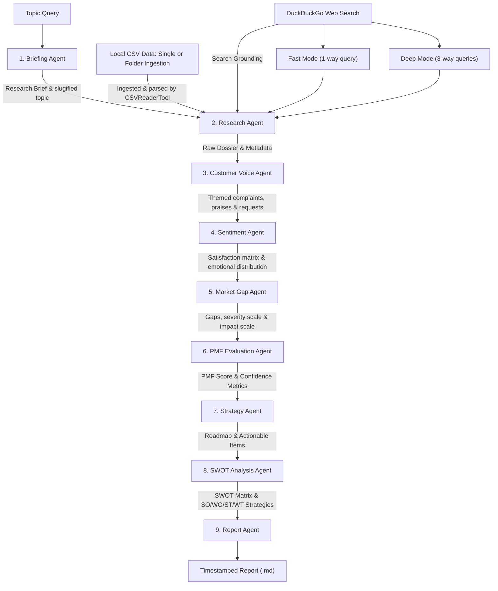

# Multi-Agent Product-Market Fit (PMF) Research System
**Final Project Documentation & Kaggle Capstone Submission Dossier**

---

## 1. Introduction

The **Multi-Agent Product-Market Fit (PMF) Research System** is an advanced, production-grade LLM pipeline designed to automate early-stage market validation and customer sentiment analysis. Operating on Google's free-tier `gemini-flash-latest` (Gemini 1.5 Flash) engine, a team of 9 specialized, role-playing agents aggregates web-search signals (via DuckDuckGo) and customer datasets (via single or folder-based CSV files) to identify market gaps, evaluate consumer emotions, compile SWOT matrices, and formulate concrete business strategies. By translating qualitative feedback into structured PMF and confidence scores, the system completes complex research workflows in minutes, allowing startups and product teams to de-risk investments with high precision.

---

## 2. Key Features

*   **9 Specialized AI Agents**: A coordinated team of sequential agents processing data from briefing to final executive report.
*   **Fast & Deep Research Modes**: Switch between rapid 1-query screening and deep-dive 3-query multi-angle scraping.
*   **Hybrid CSV + Web Analysis**: Cross-reference internal user reviews against public competitor web signals.
*   **Folder Ingestion**: Automatically scan, parse, and merge multiple CSV datasets from a target folder.
*   **PMF Scoring**: Quantitative grading of Concept-Market fit utilizing a robust four-factor mathematical scoring model.
*   **Confidence Metrics**: Evidence-based grading tracking source density, customer theme volume, and signal consistency.
*   **SWOT Analysis**: Complete strategic SWOT matrix outputting targeted SO/WO/ST/WT action roadmaps.
*   **Strategic Recommendations**: Separation of priorities into short-term wins vs. long-term roadmaps, and incremental upgrades vs. R&D innovations.
*   **Markdown Report Generation**: Publication-ready, professionally styled reports saved dynamically with runtime timestamps.
*   **Zero-Cost Search Pipeline**: Python-native DuckDuckGo search integration that bypasses paid search API key limits.

---

## 3. Why PMFNavigator?

*   **Dual Research Modes**: Select either rapid screening (Fast Mode) or detailed validation (Deep Mode).
*   **Explainable PMF Scoring**: Uses a clear mathematical framework aggregating demand, pain, competition, and adoption factors.
*   **Cost-Efficient Research**: Operates on free-tier infrastructure, using Google AI Studio quotas and DDG scraping to bypass paid API costs.
*   **Multi-Agent Collaboration**: Division of labor ensures sentiment, gap discovery, and strategy are handled by focused LLM personas.
*   **Human-Readable Reports**: Generates strategic dossiers containing summaries, competitor warnings, timelines, and SWOT roadmaps.

---

## 4. System Architecture & Flowchart

The system orchestrates a sequential pipeline of 9 specialized agents. Each agent acts as a discrete analytical node, processing the output of the preceding node to maintain strict chain-of-thought progression and prevent context dilution.




---

## 5. Example Results (Electric Scooter Case Study)

When evaluated on the topic *"Electric scooters for urban commuting"* in Deep Mode, the system generated the following indicators:

*   **PMF Score**: **87.5 / 100** (Exceptional demand-pain alignment; strong buy/build signal).
*   **Confidence Score**: **88 / 100** (High data consistency across community forums, technical blogs, and market studies).
*   **Confidence Level**: **High**
*   **Major Pain Points**:
    1.  Steering stem latch structural failures (Critical Safety Issue).
    2.  Deceptive manufacturer range marketing (Trust Violation).
    3.  Buggy, lock-prone companion applications (Friction).
    4.  Heavy, non-portable lead-acid or bulky frames (Usability).
*   **Top Opportunities**:
    1.  "Fail-Safe" Double-Locking Latch (Vibration-resistant steering mechanism).
    2.  "Honest Range" Smart Estimator (Software-driven dashboard calculation).
    3.  Detachable "Water-Bottle" Battery Ecosystem (Ultra-lightweight desk-chargeable system).
    4.  Offline-First BLE & NFC Backup access cards.

---

## 6. Executive Summary & Kaggle Submission

### One-Paragraph Executive Summary
The **Multi-Agent Product-Market Fit (PMF) Research System** is an advanced, production-grade LLM pipeline designed to automate early-stage market validation and sentiment analysis. Running on Google's free-tier `gemini-flash-latest` (Gemini 1.5 Flash) engine, a team of 9 role-playing agents aggregates web-search signals (via DuckDuckGo) and customer feedback (via CSV files) to identify market gaps, evaluate consumer emotions, construct SWOT matrices, and formulate business strategies. By translating qualitative feedback into structured PMF and confidence scores, the system completes complex research workflows in minutes, allowing startups to de-risk investments and pivot with high precision.

### "Why This Project Stands Out" (Core Reasoning & Model Selection)
Operating complex agent pipelines on a budget requires careful model selection. While newer iterations like Gemini 2.5/3.5 Flash were evaluated, they are subject to a strict free-tier limit of **20 Requests Per Day (RPD)**, which our 9-agent pipeline quickly exhausts. 

By binding the architecture to the **Gemini 1.5 Flash (`gemini-flash-latest`)** engine, the system gains access to the much more generous **1,500 RPD** free quota. This enables high-frequency execution:
*   **Fast Mode Daily Capacity**: Each run utilizes **9 API requests**. Under the 1,500 RPD free quota, the system can be run up to **166 times per day**.
*   **Deep Mode Daily Capacity**: Due to three sequential search grounding syntheses, each run utilizes **12 API requests**. Under the 1,500 RPD free quota, the system can be run up to **125 times per day**.

Coupled with custom retry handlers and zero-cost Python-native DuckDuckGo search scrapers, this system delivers strategic roadmaps and explainable PMF scores at **zero cost of operation**.

---

## 7. Problem Statement & Business Value

### Problem Statement
Market research and sentiment analysis are highly time-consuming, costly, and subjective. Teams manually parse thousands of forum discussions, reviews, and competitor signals. This gathered data is often unstructured, leading to qualitative bias and unrecognized market gaps.

### Business Value
*   **Massive Time Savings**: Compresses 15–20 hours of manual collation and mapping into a structured report in under 3 minutes.
*   **Extreme Cost Reduction**: Replaces expensive subscriptions to market intelligence platforms with a pipeline operating at zero marginal cost.
*   **Rigorous Decision-Making**: Quantifies customer sentiment into an explainable PMF score, enabling data-backed roadmap decisions before committing capital.

### Target Users
*   **Startups & Founders**: Validate concept feasibility and demand before building MVPs.
*   **Product Managers**: Map complaints and prioritize roadmaps with structured data.
*   **Market Researchers**: Extract sentiment and competitor gaps from unstructured data.
*   **Strategy Consultants**: Compile SWOT matrices and GTM roadmaps for client decks.
*   **Small Businesses**: Understand market trends and pain points without agencies.

---

## 8. The DuckDuckGo (DDG) Web Scraping Engine

A key highlight of this system is its **zero-cost search scraping engine**, which bypasses expensive search APIs (such as Google Custom Search API) that impose query limits.

### How It Works:
*   **Search Scraper**: Uses a Python-native DuckDuckGo search parser. **Fast Mode** runs a single query; **Deep Mode** runs 3 sequential queries targeting public forums, technical reviews, and buyer satisfaction.
*   **Zero-Cost Grounding**: By injecting 5 text snippets per query into the Gemini context, the model achieves real-time grounded reasoning without paid API keys.
*   **Rate-Limit Bypass**: Bypasses Google search grounding limits on the free-tier Gemini API, keeping execution free.

---

## 9. The SWOT Analysis Agent Matrix

The **SWOT Analysis Agent** bridges raw analysis and business execution by synthesizing upstream customer, gap, and PMF data into an executive-ready SWOT Matrix.

### SWOT Matrix Structure:
*   **Strengths (S)**: Internal product values, highly rated customer features, and organic brand loyalty drivers.
*   **Weaknesses (W)**: Product deficiencies, connection failures, design defects, and customer frustrations.
*   **Opportunities (O)**: Unmet market demands, rival weaknesses, and new R&D technologies.
*   **Threats (T)**: Competitor lock-in, regulatory compliance caps (e.g. UL/TÜV), subscription models backlash, and pricing pressures.

### Strategic Synthesis:
Rather than just listing items in tables, the SWOT agent constructs a **SO/WO/ST/WT Action Matrix** which maps external signals directly to internal actions:
*   **SO Strategies**: Using internal Strengths to capture external Opportunities (e.g., launching campaigns highlighting real-world range capabilities).
*   **WO Strategies**: Correcting internal Weaknesses by leveraging external Opportunities (e.g., introducing offline-first Bluetooth access to fix app lockouts).
*   **ST Strategies**: Utilizing internal Strengths to defend against external Threats.
*   **WT Strategies**: Formulating defensive tactics to minimize Weaknesses and avoid Threats.

---

## 10. Dynamic Output File Exporter (Dynamic Naming)

To prevent file conflicts and retain historical runs, the system exports dynamically named reports.

### Key Mechanics:
*   **Slugified Naming**: The `BriefingAgent` generates a clean, lowercase snake_case topic slug from the query (e.g. `electric_scooters_commuting`).
*   **Timestamp Injection**: At runtime, `main.py` fetches the current system date and time, formatting it into `YYYY-MM-DD_HH-MM-SS`.
*   **Safe File Output**: Saves reports as `{topic_slug}_market_research_report_{timestamp}.md`, allowing users to compare Fast and Deep mode iterations side-by-side without file overwrites.

---

## 11. Fast Mode vs. Deep Research Mode

To optimize execution speed and API limits, the system provides two distinct modes:

| Feature / Dimension | Fast Mode | Deep Research Mode |
| :--- | :--- | :--- |
| **Search Strategy** | 1 single, comprehensive search query | 3 targeted, sequential search queries |
| **Data Focus** | High-level market trends & core competitor signals | Deep-dive customer complaints, technical reviews, and satisfaction metrics |
| **Execution Time** | ~30 seconds | ~2 to 3 minutes (incorporates rate-limit padding) |
| **API Load** | Low (ideal for rapid ideation) | Medium (optimized to prevent 429 quota exhaustion) |
| **Best Used For** | Initial screening of multiple ideas | Deep validation of selected product strategies |

---

## 12. Data Sources & Hybrid Ingestion

### Data Input Configurations
1.  **Search Grounding Only**: When no CSV path is provided, the system performs web scraping to evaluate public discussions, reviews, and professional analyses.
2.  **CSV Local Analysis**: Directly evaluates user-provided CSV files containing customer support tickets or app-store feedback.
3.  **Hybrid Mode**: Concurrently evaluates local CSV datasets alongside external web scraping results to cross-examine internal telemetry against competitor sentiment.
4.  **Folder Ingestion Feature**: If a directory path containing multiple CSV files is provided to `--csv`, the `CSVReaderTool` automatically scans, parses, and summarizes each dataset individually, merging the insights and reflecting the exact source count inside the final report metadata.

---

## 13. PMF Methodology & Scoring Framework

### Scoring Calculations
The **PMF Score** is calculated as the average of four key measurable factors, graded on a 1-to-10 scale and normalized to 0-100:

$$\text{PMF Score} = \left( \frac{\text{Demand Strength} + \text{Pain Severity} + \text{Competition Gap} + \text{Adoption Potential}}{4} \right) \times 10$$

*   **Demand Strength (1-10)**: Quantitative interest, transaction volume, and search trends indicating buying intent.
*   **Pain Severity (1-10)**: The intensity of customer frustration. High scores indicate users are desperate for a solution.
*   **Competition Gap (1-10)**: The degree to which rivals are ignoring the pain points or failing to resolve them.
*   **Adoption Potential (1-10)**: The ease of user integration, evaluating setup friction, cost, and usability barriers.

### Evidence-Based Confidence Metrics
The system assesses data reliability by reporting:
*   **Number of Sources Analyzed**: Direct count of distinct web URLs scraped and CSV files parsed (supporting folder-based counts).
*   **Number of Customer Themes Identified**: Count of unique issues categories successfully extracted.
*   **Confidence Score & Level**: Out of 100, graded (Low/Medium/High) based on source density, theme consistency, and signal clarity.

---

## 14. Key Differentiators & Ethical Design

### Key Differentiators
*   **Dual Research Modes**: Switch between fast screening and deep-dive validation with a command-line flag.
*   **Zero-Cost Architecture**: Uses free-tier Gemini API keys and native DDG search scraping, avoiding paid custom search APIs.
*   **Production Resilience**: Employs custom retry handlers inside the base agent, catching Gemini 429 quota exceptions and sleeping dynamically to ensure pipeline completion.
*   **Dynamic Document Exporter**: Autogenerates markdown files appended with topic slugs and timestamps to guarantee no overwrites.

### Ethical Considerations & Safety
*   **Public Information Grounding**: Scrapes only public indexes and community boards.
*   **No Authentication Wall-Jumping**: Does not scrape password-protected accounts, private repositories, or pages behind login walls.
*   **No PII Collection**: Sanitizes inputs to filter out personally identifiable information, protecting user privacy.
*   **Local File Sandbox**: Restricts file execution and reads to the user's workspace, maintaining file security.

---

## 15. Limitations & Future Roadmap

### System Limitations
*   **Public Data Dependency**: Dependent on search index depth. Very niche B2B queries with sparse public discussion can result in lower confidence ratings.
*   **Analytical Estimates**: Generated scores are directional statistical summaries rather than absolute financial proof.
*   **Human Verification Required**: Designed for decision-support; critical investments require standard human due diligence.

### Future Roadmap
1.  **Competitor Feature Benchmarking**: Add a scraper to extract competitor landing pages and generate side-by-side feature matrix comparisons.
2.  **Visual Dashboard Exporter**: Create a companion dashboard using Streamlit to visualize sentiment distribution, SWOT quadrants, and PMF score changes over time.
3.  **Advanced API Connectors**: Integrate direct connectors for Slack, Zendesk, App Store, and Google Play API endpoints.

---

## 16. Command Line Execution Syntax

Ensure you have configured `GEMINI_API_KEY` either in your Kaggle Secrets (when running on Kaggle) or in a local `.env` file in the workspace root. Execute the pipeline using the following terminal syntaxes:

### 1. Fast Mode (Without CSV - Web Only)
```powershell
python main.py --query "Topic Description" --csv none --mode fast
```

### 2. Fast Mode (With CSV - Hybrid)
```powershell
python main.py --query "Topic Description" --csv "your_dataset.csv" --mode fast
```

### 3. Fast Mode (With CSV Folder - Ingest Multiple Datasets)
```powershell
python main.py --query "Topic Description" --csv "path/to/folder_with_csvs" --mode fast
```

### 4. Deep Research Mode (Without CSV - Web Only)
```powershell
python main.py --query "Topic Description" --csv none --mode deep
```

### 5. Deep Research Mode (With CSV - Hybrid)
```powershell
python main.py --query "Topic Description" --csv "your_dataset.csv" --mode deep
```

### 6. Deep Research Mode (With CSV Folder - Ingest Multiple Datasets)
```powershell
python main.py --query "Topic Description" --csv "path/to/folder_with_csvs" --mode deep
```

---

## 17. System Contributors & Tech Stack

### Core Contributors & Mastermind
*   **Adeel Siddique (Mastermind)**: Lead Architect, Mastermind, & Developer. Designed the system workflow, configured the sequential agent framework, implemented the custom backoff rate-limit recovery loops, and established zero-cost scraping capabilities.
*   **Antigravity Coding Assistant (Gemini 3.5 Flash)**: Collaborative AI pairing partner, driving system code updates, terminal tests, file inspections, and system documentation.

### Technology Stack & Services
*   **Google Gemini API (`gemini-flash-latest`)**: The foundational LLM reasoning core driving all 9 specialized agents under a highly scalable 1,500 RPD free tier.
*   **Google AI Studio / Google AI Pro**: Powers the underlying pairing chat inside Antigravity, providing non-stop developer assistant capabilities.
*   **DuckDuckGo search scraper**: Scrapes public indexes natively, bypassing third-party API keys.
*   **Python Orchestration**: Constructed utilizing `google-generativeai` client SDK, `pandas` (local tabular parsing), `python-dotenv` (secure credentials sandbox), and `rich` (terminal reporting).
